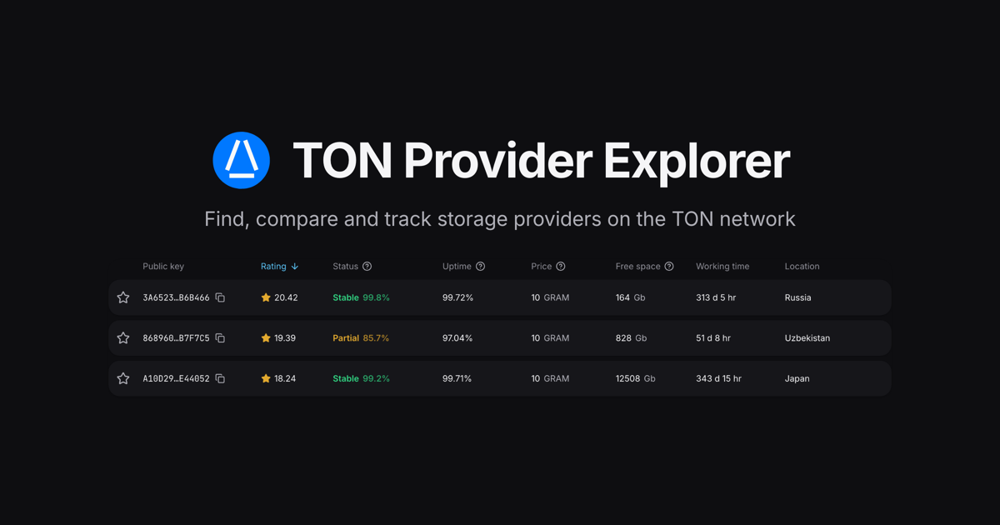

# 💎 TON Provider Explorer

[](LICENSE)
[](https://www.typescriptlang.org/)
[](https://react.dev/)
[](https://www.docker.com/)



**TON Provider Explorer** is a web catalog of TON Storage providers. Browse the list with search, sorting and
filters, open any provider to see its status, telemetry, hardware and network details, and pin favorites — theme
and language are remembered by the browser.

## Usage

Requires Node 22 and pnpm 11.

1. Install dependencies:

   ```bash
   pnpm install
   ```

2. Start the dev server:

   ```bash
   pnpm dev
   ```

The app starts on `:5173` and fetches providers from the public catalog API.

### Production build

```bash
pnpm build
```

The app is built into static files in `dist/`, served by any static host. To check the result locally:

```bash
pnpm preview
```

Unit tests cover the catalog API, the provider model and the formatting helpers:

```bash
pnpm test
```

Two optional build-time variables point at the production site by default and are baked into the bundle:

| Variable        | Description                                                   | Default                            |
|-----------------|---------------------------------------------------------------|------------------------------------|
| `VITE_API_URL`  | Base URL serving `/providers/search`                          | `https://mytonprovider.org/api/v1` |
| `VITE_SITE_URL` | Origin the app is served from, for absolute links in previews | `https://mytonprovider.org`        |

To build for another origin:

```bash
VITE_API_URL=https://example.com/api/v1 \
VITE_SITE_URL=https://example.com \
pnpm build
```

## Docker

To run a self-hosted instance (behind your own reverse proxy, for example) without installing Node:

```bash
docker compose up -d --build
```

The app is served on `:8080`; set `PORT`, `VITE_API_URL` and `VITE_SITE_URL` in the environment to override.

To only build the static files without Node or a running container:

```bash
docker build --target dist --output dist .
```

Opening `#<pubkey>` shows that provider straight away; the key is case-insensitive.

## Deployment

Every push to `master` runs lint, tests and build in CI.

Deploy to GitHub Pages:

```bash
pnpm run deploy
```

The build runs with `--base /mytonprovider-frontend/`, so asset paths resolve under the project page URL.

One-time setup: in the repository settings, point **Pages → Source** to the `gh-pages` branch.

## License

This repository is distributed under the [Apache License 2.0](LICENSE).
